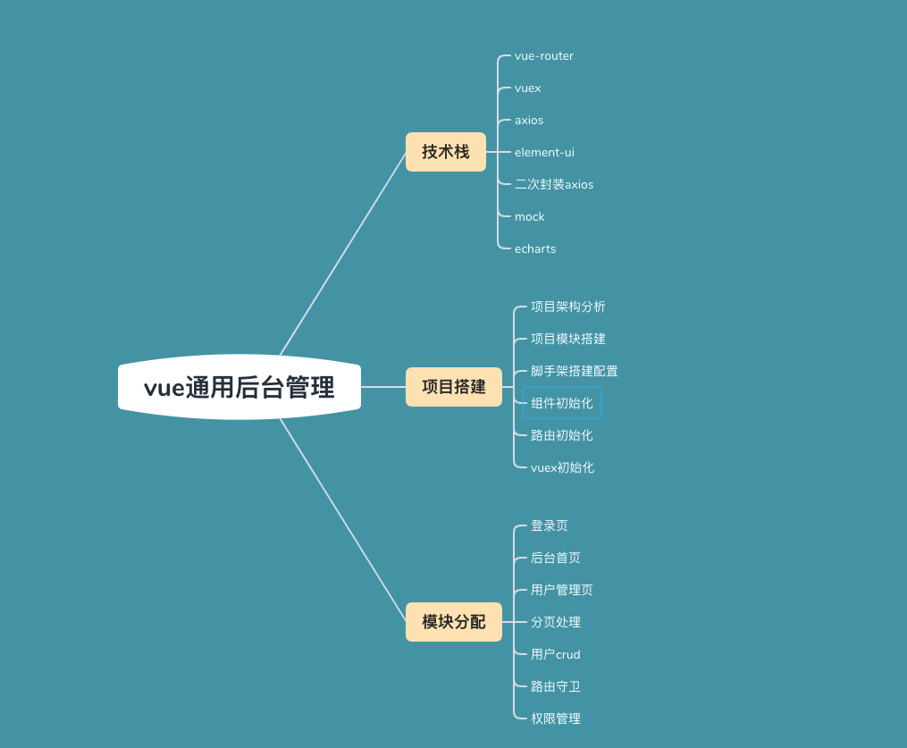

# 项目的技术栈展示 以及项目的核心重点部分


1. 项目搭建+使用element实现首页布局
2. 顶部导航菜单及与左侧导航联动的面包屑实现
3. 封装一个ECharts组件 
4. 封装一个Form表单组件和Table表格组件 
5. 企业开发之权限管理思路讲解


# 脚手架的搭建
## 1. 进入官网下载node.js
node版本必须在10.0.0以上才支持
- 查看版本：node -v
## 2. 安装 cnpm(中国镜像站：npmmirror.com)
```
npm install -g cnpm --registry=https://registry.npm.taobao.org
```
- 查看版本：cnpm -v
- 如果查看报错：……在此系统上禁止运行脚本 ==> [解决方法](https://blog.csdn.net/weixin_43252521/article/details/121874239?spm=1001.2014.3001.5506)
- 或者不装cnpm，安装yarn也可以(二者区别详看 ==> yarn和npm对比.md)
  ```
  npm install -g yarn
  ```
## 3. 安装vue-cli脚手架
```
cnpm install -g @vue/cli
```
- 查看版本：vue -V
## 4. 创建项目
- vue create vue-manage(项目名)
- 空格切换vue版本,选择default([vue2],babel,eslint)=>回车(过程中卡住不动，按下回车就好了)
- 输入：Y 

## 5. 启动项目
```
cd vue-mansge
```

```
npm run serve
```

# element-ui的使用

## 网页直接使用
[官网安装](https://element.eleme.cn/#/zh-CN/component/installation)

- 引入样式和组件库
  ```
  <link rel="stylesheet" href="https://unpkg.com/element-ui/lib/theme-chalk/index.css">

  <script src="https://unpkg.com/element-ui/lib/index.js"></script>
  ```

## 在脚手架中使用
### 全部引入 
- npm i element-ui -S
- 在 main.js 中加入以下内容：
  ```
  import ElementUI from 'element-ui';
  import 'element-ui/lib/theme-chalk/index.css';

  Vue.use(ElementUI);
  ```

### 按需引入 
- npm install babel-plugin-component -D
- 然后，将 .babelrc 修改为：
  ```
  {
    "presets": [["es2015", { "modules": false }]],
    "plugins": [
      [
        "component",
        {
          "libraryName": "element-ui",
          "styleLibraryName": "theme-chalk"
        }
      ]
    ]
  }
  ```
- 如果只希望引入部分组件，那么需要在 main.js 中加入以下内容：
  ```
  import { Button, Select } from 'element-ui';
  import App from './App.vue';

  Vue.use(Button)
  Vue.use(Select)
  ```
# 路由的使用
## 1. 引入路由
```
npm i vue-router@3
```
这里注意我们使用的是vue2，对应的路由版本是3
## 2. 使用路由的步骤
- 首先在main.js 中加入以下内容：
  ```
  import router from './router'

  new Vue({
    router,
    ……
  })
  ```
- 创建router文件以及它的index.js
  ```
  import Vue from 'vue'
  import VueRouter from 'vue-router'

  Vue.use(VueRouter)

  export default ({
    routes: [
      {
        path: '/',
        name: 'Home',
        component: () => import()
      }
      ……
    ]
  })
- 最后记得在App.vue中引入
  ```
  <router-view></router-view>
  ```
# 引入less
```
npm i less
npm i less-loader@5.0.0
```